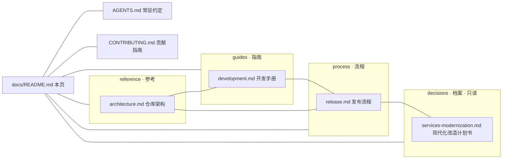

# 文档索引（docs）

> `services`（Koishi-CE 服务型插件 monorepo）的文档集入口：分层手册与决策档案的导航页。
> 仓库级常驻约定（所有会话与 agent 必读）见 [AGENTS.md](../AGENTS.md)；人类贡献者入口见 [CONTRIBUTING.md](../.github/CONTRIBUTING.md)。

## 文档地图

docs 根下有本导航页；手册按性质分层：**指南**（guides，怎么开发）、**参考**（reference，仓库是什么）、**流程**（process，特定流程怎么走）与**档案**（decisions，Why / 历史快照，只读）。

## 手册清单

持续维护（随代码演进更新），以实际代码为准：

| 文档 | 内容速览 | 何时读 |
| --- | --- | --- |
| [guides/development.md](guides/development.md) | 环境 · PR 工作流 · 命令 · 门禁构成 · 构建产物布局 · 编码约定 · 测试 · 已知坑 | 日常开发、开 PR、跑门禁前 |
| [reference/architecture.md](reference/architecture.md) | 包清单 · 依赖纪律 · 构建 / 类型 / 测试体系 · 许可证与来源 | 改包结构 / 依赖 / 构建链前 |
| [process/release.md](process/release.md) | changesets · CI 发布链（OIDC 可信发布） · 发布面字段与补发 · 事故铁律 | 发版前 |

各手册开头统一带「本文结构」行（编号章节速览），正文引用具体节时用锚点链接。

## 档案区（只读参考）

| 文档 | 内容 | 状态 |
| --- | --- | --- |
| [decisions/services-modernization.md](decisions/services-modernization.md) | 仓库现代化改造计划书：现状底账 · 差距清单（G1–G25）· 分阶段计划（阶段 0–7）· 决策点裁定 · 验收标准 · 仓库设置清单 | 实施中（阶段 0–3 已完成，2026-09-28 起草）；档案只读，现状以代码与各手册为准 |

## 文档组织约定

新增或修改 docs 时遵守，保证结构与风格一致：

1. **分层**：手册（guides / reference / process）持续维护；档案（decisions）只读（开头注明日期与状态）。阶段性设计 / 交接直接写进提交信息与 PR 正文，不单独立档。
2. **页面模板**：`# 标题` → 引用块（定位 + 「本文结构」）→ 编号章节。长文档可在开头加节内目录。
3. **章节编号**：中文手册 `## N. 标题` 二级、`### 小节` 三级；引用章节写作「见 §N」或锚点 `目标.md#n-标题`。
4. **交叉引用**：一律相对路径、不带 `./` 前缀（同目录 `release.md`、跨目录 `../guides/development.md`、指仓库根 `../../AGENTS.md`）；`.github/` 顶层社区健康文件（CONTRIBUTING 等）按 GitHub 规则从仓库根解析，须带 `./` 前缀。docs 根下不新增散落 md，新手册按性质入层。
5. **链接存活**：改动文档后跑 `bun tooling/checks/docs-links.ts` 校验全部相对链接与锚点（覆盖 docs 全树、根部门面与 `.github/` 文档），应当保持通过。
6. **与 AGENTS.md 不重复**：AGENTS 放铁律（精简），docs 放方法与理由；需要时用链接而非抄写。
7. **不写死漂移数据**：版本号、文件数、用例数等以 `package.json` 与命令输出为准，不在文档中写死；确需记录时注明日期与口径。
8. **语言**：简体中文、不用 emoji。
